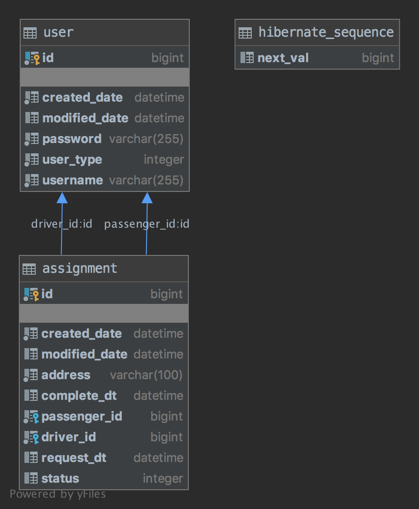

# TaxiServiceBe

[](https://travis-ci.org/hussard015/TaxiServiceBe)
[](https://coveralls.io/github/hussard015/TaxiServiceBe?branch=master)

- 택시 배차 앱 API 서버 (과제용)

## 실행 방법
```
- ./gradlew clean build
- java -jar ./build/libs/taxiservicebe-0.0.1-SNAPSHOT.jar
```

## Dependency
- Spring Boot
- Spring Jpa
- Spring Security
- Spring Rest Docs
- Sqlite

## 프로젝트 설명
- Spring Security와 JWT를 사용하여 인증을 구현하였습니다.
- JWT 유효시간은 1시간 입니다.
- Spring Rest Docs를 사용하여 API 문서를 관리합니다.
- 서버의 기본 포트는 8080 입니다.

## API 스펙 문서
- 서버 실행 후, http://localhost:8080/docs/index.html 에서 확인
- 혹은, http://htmlpreview.github.io/?https://github.com/hussard015/TaxiServiceBe/blob/develop/src/main/resources/static/docs/index.html 에서 확인 가능

## ERD


## 개발 도중 이슈
- Spring Jpa ddl-auto 로 테이블을 자동 생성하게 되면, FK를 설정해주지 못함. 그래서 테이블을 스크립트로 작성하였음. (schema.sql)
- Spring Jpa로 Sqlite를 사용하면, 트랜잭션기능을 전혀 못쓰게 되는 것 같음. Sqlite가 디비 접근시 커넥션하나만 허용해서 그런듯.
- OneToOne 관계에서 쿼리실행 시, N + 1 문제 발생. Sqlite에서 트랜잭션을 사용하지 못해 영속성을 Service 계층까지 가져오지 못함. 그래서 FetchType Lazy시 프록시에 접근하면 익셉션 발생해서 개선 불가능해 보임.
- 배차 완료는 Http method를 post로 보내야할까 put으로 보내야 할까 고민

## 개선 필요 사항
- Error Response에 ErrorCode 추가 할 필요가 있음. 예) 파라미터 값이없음 001, 파라미터 타입이 잘못되었음 002, 이미 배차 중 010.. 
- 배차 취소 및 삭제기능
- JWT validation check를 스프링 시큐리티 필터로 하는데 Exception 처리가 어려워서, exception 발생시, 토큰 만료되었다는 메세지와 토큰이 잘못되었다는 메세지를 구분 못함. 필터 대신 커스텀 인터셉터를 만들어 이용하면되지만, 그럼 스프링 시큐리티 기능을 사용하지 않는게 좋아보임.
- 너무 프레임워크 의존적인 코드들임. 어노테이션도 너무 많음.. 작성이 편하긴하지만 라이브러리 의존적인 코드들은 개선이 필요할 듯 보임.
